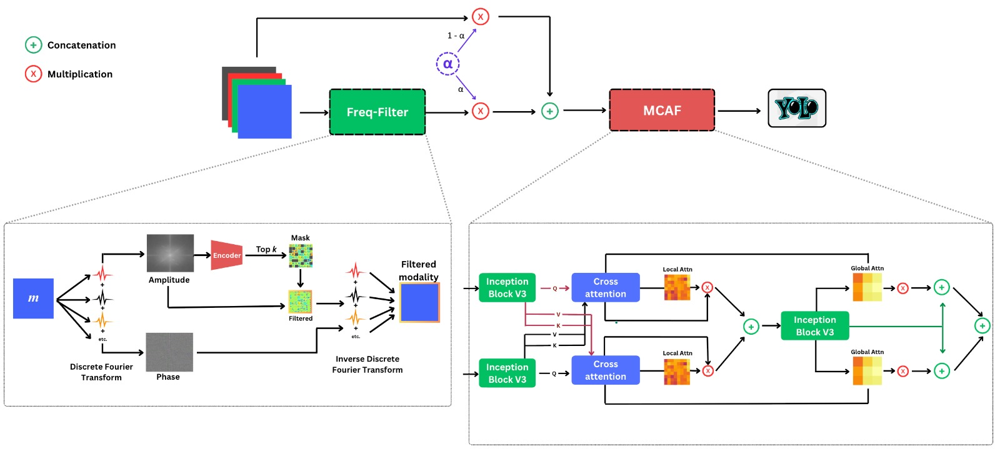

# FMCAF
This is the modified version of the ultralytics Library allowing the replication of my workm which invlves the FMCAF module

<p align="center">
  
</p>

# 🔧 Custom Ultralytics YOLO (Multimodal + Preprocessing Support)

This repository contains a **modified version of the [Ultralytics YOLO](https://github.com/ultralytics/ultralytics)** library to enable:

- Direct loading of `.npy` files for multimodal input (e.g., RGB + IR).
- Insertion of custom preprocessing modules **before** the YOLO backbone.
- Clean modular handling of each modality (e.g., splitting after concatenation).

---

## 📁 Key Modifications

### 🧩 1. Input File Format Support (`.npy`)
- Modified the data loading pipeline to support **`.npy`** files instead of standard image formats.
- Each `.npy` file is expected to be a **concatenated tensor** of two modalities (e.g., RGB + IR).
- During preprocessing, the modalities are **split** and processed independently.

### 🧪 2. Custom Preprocessing Integration
- Introduced a hook into the model's `forward()` function to allow passing inputs through a **preprocessing module** **before** the YOLO backbone.
- You can plug in any custom logic for:
  - Frequency filtering
  - Normalization
  - Modality-specific enhancement
  - Cross-attention fusion, etc.


##  Integration Summary

To integrate our preprocessing modules into Ultralytics explained in section 2 Above:

1. **Initialize in `__init__()` of DetectionModel**

```python
self.FreqFilter = FreqFilter()
self.MCAF = MCAF()
self.alpha = torch.nn.Parameter(torch.tensor(0.2))
```
2. **Inject in `DetectionModel.forward()` (`ultralytics/nn/tasks.py`)**

```python
def forward(self, x, *args, **kwargs):
    batch = x  # Preserve batch dict
    if isinstance(x, dict):  # Training input format
        x = x["img"]

    filtered_x = self.FreqFilter(x)
    alpha = torch.clamp(self.alpha, 0, 1)
    mixed_input = alpha * filtered_x + (1 - alpha) * x

    x = self.MCAF(mixed_input)

    if self.training:
        out = self._predict_once(x)
        return self.loss(batch, out)
    return self.predict(x, *args, **kwargs)
```

##  References 
[1] Yoann Dupas, Olivier Hotel, Gre ́goire Lefebvre, and Christophe Ce ́rin. Mefa: Multimodal image early fusion with attention module for pedestrian and vehicle detection. In Proceedings of the 20th International Joint Conference on Computer Vision, Imaging and Computer Graphics Theory and Applications - Volume 3: VISAPP, pages 610–617. INSTICC, SciTePress, 2025.[Paper Link](https://www.scitepress.org/Papers/2025/132360/132360.pdf)
